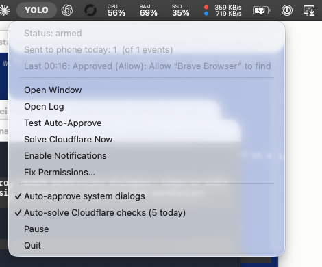

# YOLO Mode

**The problem:** you come back to a Claude Code session that has done nothing
for forty minutes, and the reason is a macOS dialog you never saw — a folder
permission, a keychain prompt, a helper-tool installer, a Cloudflare checkbox
on a browser tab that was never in front. The agent was never stuck on the
work. It was stuck behind a window.

YOLO Mode watches for those dialogs, clicks Allow on the ones it recognises,
and writes down every one it clicked. What it can't safely answer, it sends to
your phone with the session's name and a link straight back into it.



Three parts:

- **Auto-approval** — macOS permission dialogs get clicked, by an allowlist of
  button titles, with Gatekeeper and 1Password held out. Cloudflare Turnstile
  checkboxes get solved. Password prompts get answered from 1Password.
- **Audit log** — every click is recorded before you hear about it: what was
  granted, to which app, at what second, and whether the phone alert went out.
  Two files, one machine-readable.
- **Alerting** — the things it will not decide for you reach your phone,
  named, with a button that reopens that exact Claude Code session.

## What an alert looks like

Not this:

```
Approval needed
/Users/you/Documents/some-project
```

This:

```
Courtyard card purchases quality: Run: git push origin main --force-with-lease
  git push origin main --force-with-lease
  Task: push the release branch and update the changelog
  Project: cy-scraper-new
  [Open session on Mac]
```

The session name comes from the `custom-title` record Claude Code writes into
its transcript. The button carries `claude://resume?session=<uuid>`, which
reopens that exact session in Claude Desktop — the only URL that does; the
`claude-cli://` scheme always starts a fresh one.

## Quiet by default

Claude Code's `Notification` hook fires both when a tool needs permission and
when a session has merely sat idle for 60 seconds. Only the first reaches your
phone. Idle nudges are logged and shown in the app, silently.

The window watcher is held to the same standard: a rule must match a
dialog-shaped window, that window must persist three polls (~6s), and the
catch-all rule additionally asks the accessibility tree whether the window
really has an Allow button. Without that last check it alerted about Notes,
FaceTime and Terminal.

## Auto-approval

On by default. When a macOS permission dialog appears — the ones that say an
app "would like to access" your Documents folder, your camera, your
microphone, your screen, another app's data — YOLO Mode clicks its approve
button and pushes an alert naming what was granted and how to undo it. A
session that used to sit there until you noticed it now carries on, and you
read about the grant afterwards instead of blocking on it.

Approval is never silent. The click is written to the audit log first and
pushed to your phone second, so the record exists even if the phone alert
doesn't go out.

Guardrails:

- Only buttons whose exact title is in `ALLOW_BUTTONS` are clicked. The
  catch-all narrows that to Allow / Always Allow / Allow While Using App —
  "OK" means "grant" on a named permission dialog, but on an unknown app's
  dialog it could be confirming a deletion.
- Two kinds are never auto-approved: **Gatekeeper** (its Allow-shaped button
  runs a program that was just downloaded, which is how a drive-by download
  becomes a running program) and **1Password** generally — with one carve-out,
  the "Allow … to get CLI access" dialog, which is auto-Authorized by a rule
  that will click nothing but a button titled exactly `Authorize`, so Unlock and
  every other 1Password prompt is untouched.
- Every auto-approval is logged and pushed after the fact.
- Off switch: the menubar toggle, or `touch ~/.yolo_mode_no_autoapprove`.

## macOS password prompts

The dialog that says *"Claude is trying to add a new helper tool. Enter your
password to allow this."* is filled in for you: YOLO Mode reads the Mac login
password from 1Password (`op://Bots/Mac login/password`), types it, and presses
the button macOS already had highlighted — `Add Helper`, `Modify Settings`,
whatever that prompt happens to call it.

**This is the one feature here that hands out privilege rather than granting a
capability.** Everything else clicks Allow on a request for a camera or a
folder; this gives away admin rights. It fires on *every* SecurityAgent prompt,
not an allowlist of apps, so anything on the Mac that can raise a password
prompt now gets one answered without a human present. That is a deliberate
trade, and the Pushover alert — high priority, sent immediately after, naming
the app and quoting the dialog — is the review step. It is sent whether or not
the fill succeeded, because a password prompt that was answered and *not*
reported is the only genuinely bad outcome available.

Guardrails, all of them learned the hard way on 2026-08-04:

- Nothing is typed until the prompt's own process is confirmed **frontmost**.
  Synthetic keystrokes follow the frontmost app, not accessibility focus — the
  first working version raised the dialog with `NSRunningApplication.activate`,
  which returns `True` for SecurityAgent and does nothing, and typed the
  password into 1Password's window instead. The dialog is now clicked with the
  real mouse, which fronts it and focuses the field in one motion, and the
  frontmost app is checked again before a key is sent.
- Nothing is submitted until the field is confirmed to hold exactly as many
  characters as were sent. A short read gets backspaced out rather than tried.
- Two attempts per dialog per run. A wrong password leaves the same dialog on
  screen, and an uncapped retry loop locks the account out.
- The password is read from 1Password per prompt, never cached, never logged,
  never written to disk. See `scripts/mac_password.py`.
- Off switch: `touch ~/.yolo_mode_no_password` (this alone), or either of the
  two broader switches above.

The read prefers a read-only 1Password **service account** scoped to the `Bots`
vault — create it yourself, in your own terminal, never from an agent session,
since the token is printed once:

```
op service-account create yolo-mode --vault Bots:read_items --expires-in 365d
# paste into ~/.config/yolo-mode/op-token, then
chmod 600 ~/.config/yolo-mode/op-token
```

Without that file it falls back to the 1Password desktop integration, which
works unattended only because the Authorize rule above clicks its dialog.

Clicking needs **Accessibility** permission. YOLO Mode presses buttons through
the accessibility API in-process rather than shelling out to `osascript`,
because macOS attributes a click to the binary that makes it — the osascript
route would require granting Accessibility to `/usr/bin/osascript`, letting any
script on the machine click any dialog.

## Cloudflare Turnstile

The same idea, one layer down: when a "Verify you are human" checkbox appears,
YOLO Mode clicks it. Merged in from the standalone `turnstile-autosolve`, which
this replaces.

It works on pixels, not the DOM. Cloudflare draws the same widget for the
inline form control and the full-page "Just a moment…" interstitial, but the
interstitial hides it in a closed shadow DOM where no script can read its
position. So the widget is template-matched on a screen grab, and clicked with
a real CGEvent — Turnstile checks `isTrusted`, and a CDP or Playwright click
reports false.

Two places it looks, both gated:

- **The scraper CDP ports** (9222/9223/9224/9225). Reading `/json/list` over
  plain HTTP is cheap and, unlike `connect_over_cdp`, doesn't hang on a busy
  Brave. An interstitial sets the tab title, so a challenged tab shows up
  without attaching. The tab is foregrounded, solved, and focus handed back.
- **The frontmost Chrome/Brave window**, which catches inline widgets — those
  never change the tab title, so the port check can't see them.

Nothing is ever captured unless a port reports a challenge or a browser is
already frontmost. Without that gate this would be a screen recorder.

Both monitors are searched. The standalone tool only looked at the main one, so
a challenge on the second screen sat there.

Needs **Screen Recording**. Without it the capture still succeeds — it just
returns the desktop with every window stripped out, which matches as "nothing
to solve" forever, so the solver checks at startup and says so rather than
running as a silent no-op.

Off switches: the menubar toggle, `touch ~/.turnstile_autosolve_off` (the old
tool's path, still honoured), or either of the global pauses.

## Install

```bash
git clone https://github.com/nathan-hekman/yolo-mode.git ~/yolo-mode
cd ~/yolo-mode
python3 -m venv .venv
.venv/bin/pip install -r requirements.txt
scripts/install_yolo_mode.sh
```

Then:

1. Put your Pushover keys in `~/.config/yolo-mode/pushover.json` (the installer
   creates an empty one). Without them everything works locally; only the phone
   alerts are skipped.
2. Grant **Accessibility** in System Settings → Privacy & Security. The
   menubar's *Fix Permissions…* item opens it and triggers the prompt.
3. Grant **Screen Recording**. Two things need it: the Turnstile solver, and
   window titles — without it macOS hides them, so alerts name the app instead
   of quoting the dialog. The installer opens the pane if it isn't granted.

For Claude Code alerts, point a `Notification` hook at the repo:

```json
{ "hooks": { "Notification": [ { "matcher": "", "hooks": [
  { "type": "command", "command": "~/yolo-mode/scripts/claude_notify_hook.sh" }
] } ] } }
```

## Controls

- **Menubar** — `YOLO` when watching, `YOLO ⏸` when paused. Menu shows today's
  counts, the last event, and toggles for pause and auto-approve.
- **Window** — recent events, colour-coded: red waiting on you, green already
  handled, grey noise. Open it from the menubar, the Dock icon, or
  `touch ~/.yolo_mode_show`.
- **Panel** — floats top-right when something needs you, stays until dismissed,
  with an Open Session button.
- **Test Auto-Approve** — raises a real dialog of its own and waits to see
  whether the watcher clicks it. A test that can't fail the way the feature
  fails isn't a test.
- **Solve Cloudflare Now** — looks for a challenge regardless of the gate,
  for when one is sitting in a window that never came to the front.

## The audit log

Anything that clicks Allow for you owes you a record of it. Everything YOLO
Mode sees — approvals it granted, prompts it left alone, idle nudges it
swallowed, its own errors — is appended to one place before anything else
happens, by the window watcher, the Claude Code hook and the UI alike.

- `~/Library/Logs/yolo-mode-events.jsonl` — one JSON object per line, what the
  window renders and what you grep. Fields: `ts`, `kind`
  (`approval` / `idle` / `system` / `error`), `what` (the headline), `source`
  (`claude` or `watcher`), `project`, `detail` (the dialog's own text),
  `pushed`, and the full `session` uuid.
- `~/Library/Logs/yolo-mode.log` — the same events as readable lines, which is
  what *Open Log* opens.

`pushed` is recorded as `push` or `quiet` on every line, so an alert you never
got is a lookup rather than a guess: either it was suppressed on purpose or
the push failed, and the log says which. The menubar shows today's counts and
the last event; the window shows the recent ones colour-coded — red waiting on
you, green already handled, grey noise. The JSONL keeps the last 500 events.

Two questions it exists to answer: *what did this thing approve while I was
away*, and *why did nothing reach my phone*.

## Notes for anyone changing this

- The bundle's executable is a **copy** of the framework's `Python.app` binary,
  not a symlink to `bin/python3.12`. A symlink gets resolved and the Dock label
  becomes "Python"; `bin/python3.12` re-execs itself into `Python.app` for GUI
  access and loses the identity the same way. Sign it, but without the hardened
  runtime — Gatekeeper refuses the copied Python under it.
- Don't gate a Claude alert on finding a pending `tool_use` in the transcript.
  The assistant turn is written after the tool completes, so at prompt time the
  block is often not on disk yet.
- The bundle must be self-contained. `Contents/lib` used to be a symlink to the
  venv, which made Gatekeeper reject the whole app ("invalid destination for
  symbolic link in bundle") -- anyone who can write the target swaps the app's
  code without breaking its signature. Copy the libraries in instead.
- Compile the bytecode caches before signing. Python validates a `.pyc` against
  its source's mtime, copying resets those, and the first run then rewrites
  hundreds of files inside a signed bundle: "a sealed resource is missing or
  invalid".
- Re-signing with a different certificate voids the Accessibility grant, and
  auto-approval stops clicking until it is granted again. The log says so at
  startup: `accessibility MISSING - cannot click`.

## Status

Alerting, session naming, the deep link, the panel, the window, logging and
auto-approval all work. Auto-approval is verified end to end: *Test
Auto-Approve* raises a real dialog and the log records `auto-approved`.

Native Notification Center posts do **not** work, and the cause is not this
app. Every request comes back `UNErrorDomain Code=1, "Notifications are not
allowed for this application"` — instantly, before the request reaches the
notification daemon, which logs nothing.

The evidence, on the machine this was built on:

- A 20-line compiled Objective-C app, signed with the same Developer ID and
  accepted by Gatekeeper, is refused the same way.
- `terminal-notifier` posts nothing either.
- `~/Library/Preferences/com.apple.ncprefs.plist`, the list macOS keeps of
  every app that has asked, holds 62 entries and **not one is third-party** —
  no browser, no chat app, nothing. It was last modified 2026-06-04.

So no third-party app on that Mac can register for notifications, and the fix
is a system one (repair or rebuild `ncprefs`), not a code one. The floating
panel covers the same ground and asks permission for nothing.

Signing is still worth doing properly, and now is: Developer ID, hardened
runtime, self-contained bundle, `spctl` verdict `accepted`.

## Why "YOLO"

It clicks Allow on your permission dialogs. The name is the warning label.

MIT licensed. No warranty, and read the auto-approval section before turning it
loose.
